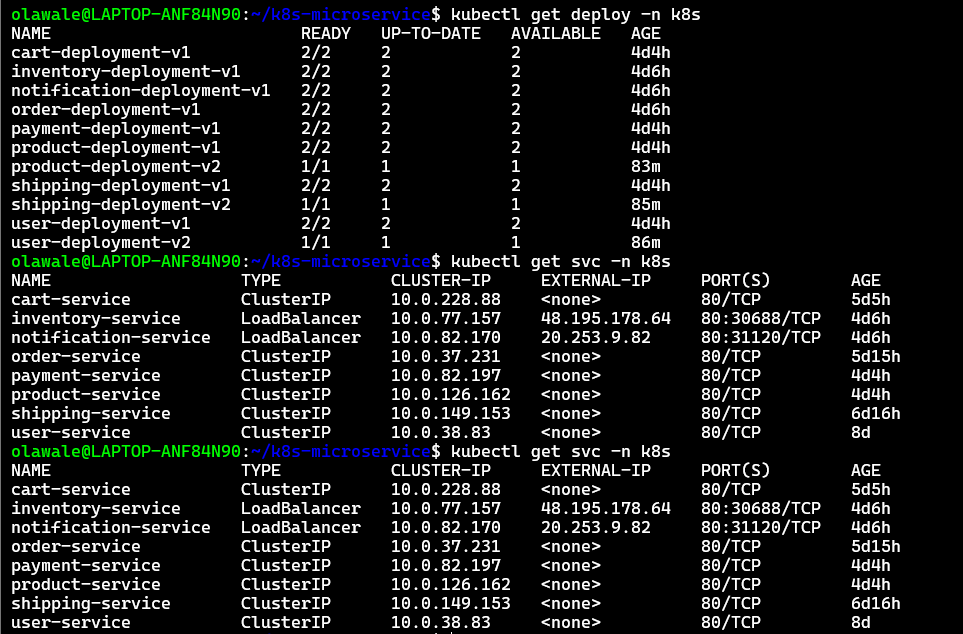
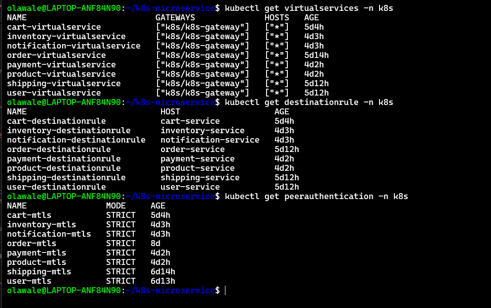
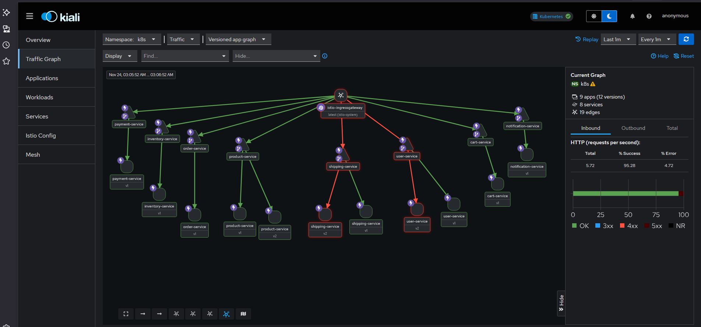

# E-commerce Microservices With Istio Mesh

This is a production-grade microservices e-commerce system showcasing **DevOps best practices, Kubernetes deployments, CI/CD pipelines, and Istio service mesh**.


#### Architecture Overview

The architecture of this project consists **eight services**, each independently deployed, containerized, and managed inside Kubernetes with **full observability, mTLS, canary releases, retries, circuit-breaking, and fault injection**.

```
┌────────────────────────────────────────────────────────────────┐
│                      Istio Ingress Gateway                     │
│                           (mTLS)                               │
└──────────────────────┬─────────────────────────────────────────┘
                       │
       ┌───────────────┼───────────────┐
       │               │               │
   ┌───▼────┐     ┌────▼───┐       ┌───▼────┐
   │Product │     │ Cart   │       │ User   │
   │Service │     │Service │       │Service │
   │v1 (90%)│     │        │       │        │
   │v2 (10%)│     └────┬───┘       └────────┘
   └───┬────┘          │
       │               │
       │          ┌────▼─────┐
       │          │Inventory │
       │          │ Service  │
       │          └──────────┘
       │
   ┌───▼────────┐
   │   Order    │
   │  Service   │
   └───┬────────┘
       │
       ├──────────┬────────────┬────────────┐
       │          │            │            │
   ┌───▼───┐ ┌────▼────┐  ┌────▼─────┐ ┌────▼───────┐
   │Payment│ │Shipping │  │Inventory │ │Notification│
   │Service│ │Service  │  │  Service │ │   Service  │
   │       │ │         │  │          │ │            │
   └───────┘ └─────────┘  └──────────┘ └────────────┘
```


## Tech Stack

### **Core Technologies**
- **Node.js, Python, Go** — Microservice implementation  
- **Docker** — Containerization  
- **Kubernetes** — Orchestration  
- **Istio** — Service Mesh (traffic routing, mTLS, observability)  
- **Azure Container Registry (ACR)** — Image storage  
- **Azure Kubernetes Service (AKS)** — Cloud environment  


# Microservices Overview

| Service                  | Language  |               Purpose                  |
|--------------------------|-----------|----------------------------------------|
| **Product Service**      | Go        | Product listing                        |
| **Cart Service**         | Node.js   | Shopping cart management               |
| **Order Service**        | Python    | Order orchestration                    |
| **Payment Service**      | Go        | Payment processing (+ 10% failure sim) |
| **User Service**         | Go        | User account management                |
| **Inventory Service**    | Python    | Stock and supply management            |
| **Shipping Service**     | Node.js   | Shipment tracking                      |
| **Notification Service** | Python    | Event-driven notifications             |


## Istio Features Implemented

#### **Service Mesh**
    - Automatic Envoy sidecar injection  
    - mTLS (STRICT mode) for all internal communication  
    - Authentication & encryption inside mesh  
    - Internal routing using VirtualServices  

#### **Traffic Management**
    - Canary deployments (90% v1 / 10% v2)  
    - Subset-based routing via DestinationRules  
    - Load balancing (ROUND_ROBIN)  
    - Ingress routing through a single Istio Gateway  

#### **Resilience Patterns**
    - Circuit breaking  
    - Outlier detection (ejects bad pods)  
    - Automatic retries (3 attempts, 2s timeout)  
    - Global timeouts for stability  
    - Connection pooling to avoid saturation  

#### **Fault Injection**
    - Delay injection  
    - HTTP aborts (503 error simulation)  
    - Controlled chaos testing  

#### **Observability**
   - **Kiali** — Mesh topology & traffic flow  
   - **Grafana** — Metrics dashboards  
   - **Jaeger** — Distributed tracing  
   - **Prometheus** — Metrics collection  

---

### Prerequisites
Install the following before starting:

- **Python** — https://www.python.org  
- **Go** — https://go.dev  
- **Node.js / npm** — https://nodejs.org  
- **Docker Desktop** — https://www.docker.com  
- **VS Code** — https://code.visualstudio.com  
- **Azure CLI** — for ACR/AKS deployments  

- **Istio** — https://istio.io/latest/docs/setup/getting-started/ 

   Install Istio:

```bash
    curl -L https://istio.io/downloadIstio | sh -
    cd istio-*
    export PATH=$PWD/bin:$PATH
```
Install control plane:

```bash
   istioctl install --set profile=demo -y
```
Verify:

```bash
   istioctl version
   kubectl get pods -n istio-system
```

### Project Setup & File Tree

A simplified file structure:

```
Ecommerce/
├── istio
│ ├── services
│ │ ├── cart
│ │ ├── inventory
│ │ ├── notification
│ │ ├── payment
│ │ ├── product
│ │ ├── user
│ │ ├── order
│ │ └── shipping
│ └── gateway.yaml
│
├── k8s-manifest
│ ├── deployment
│ └── namespace.yaml
│
├── services
│ ├── go-services
│ │ ├── payment
│ │ ├── product
│ │ └── user
│ ├── node-services
│ │ ├── cart
│ │ └── shipping
│ └── python-services
│ ├── inventory
│ ├── notification
│ └── order
│
├── .gitignore
└── README.md

```

#### Step 1 — Enviroment s up Cluster and Build Services   
Each service was developed and tested locally using Node.js, Python, or Go to confirm output, routes, and inter-service behavior.


#### Step 2 — Dockerizing Each Service

  **Log in to ACR**
```bash
az acr login --name <acr-name>
```

 **Build and Push**
```bash
docker build -t acr-name.azurecr.io/user-service:v1 .
docker push acr-name.azurecr.io/user-service:v1
```` 
```
Repeat for other services (cart,product,inventory,notification)


#### Step 3 — Kubernetes Deployment
Create namespace:
```bash
kubectl create ns k8s
```

Apply deployment + service:

```bash
kubectl apply -f user/deployment-v1.yaml
kubectl apply -f user/service.yaml
```
For canary (v2):
```bash
kubectl apply -f user/deployment-v2.yaml
```
Check status:

```bash
kubectl get deploy -n k8s
kubectl get pods -n k8s
kubectl get svc -n k8s
```



**Note:** All services use `ClusterIP` because Istio manages traffic internally
          App listen Port must match the container to avoid upstream error 


#### Step 4 — Apply Istio Configuration

Each service receives:

* VirtualService
* DestinationRule
* PeerAuthentication

```
kubectl apply -f istio/user-virtualservice.yaml
kubectl apply -f istio/user-destinationrule.yaml
kubectl apply -f istio/user-peerauthentication.yaml
```


Check Status

kubectl get virtualservice -n <namespace>
kubectl get destinationrule -n <namespace>
kubectl get peerauthentication -n <namespace>




Test external access:

```bash
curl http://<INGRESS-IP>/user
```
---

#### Step 6 — Observability

### **Kiali**

```
istioctl dashboard kiali
```


### **Grafana**


#### Completed Features

✔ 7 microservices
✔ Kubernetes deployments
✔ ACR image hosting
✔ Canary rollout with v1/v2
✔ Full Istio mesh
✔ mTLS STRICT mode
✔ Circuit breaking + retries + timeouts
✔ Fault injection tests
✔ Observability suite


